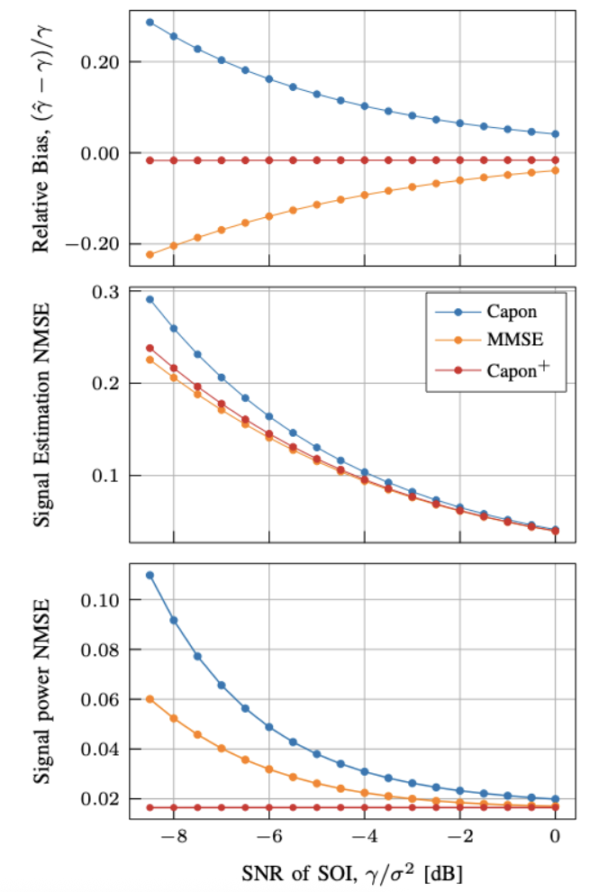

# Capon+: Beamforming design for minimizing the signal power estimation error
This repository includes the source code used in our recent paper:

[1] Esa Ollila, Xavier Mestre and Elias Raninen, ["Beamforming design for minimizing the signal power estimation error"](https://arxiv.org/abs/), arXiv preprint arXiv: (2025).

A preliminary version of this work can be found in: 

[2] Esa Ollila, Xavier Mestre and Elias Raninen, ["Approach to beamforming minimizing the signal power estimation error"](https://cmsworkshops.com/EUSIPCO2025/TempDev/view_paper.php?PaperNum=1633), 2025 33rd European Signal Processing Conference (EUSIPCO), Palermo, Italy, Sept. 8-12, 2025. 

If you use the codes, then please cite the references above!

## Absract
 We study the properties of beamformers in their ability to either maintain or estimate the true signal power of the signal of interest (SOI). Our focus is particularly on the Capon beamformer and the minimum mean squared error (MMSE) beamformer. The Capon beamformer, also known as the minimum power distortionless response (MPDR) or the minimum variance distortionless response (MVDR) beamformer, is a widely used method in array signal processing.  A curious feature of both the Capon and the MMSE beamformers is their tendency to either overestimate or underestimate the signal power. That is, they are not asymptotically unbiased (as the sample size approaches infinity). To address this issue, we propose to shrink the Capon beamformer by finding a scaling factor that minimizes the mean squared error (MSE) of the signal power estimate. The new beamformer, referred to as the Capon$^+$ beamformer, is evaluated against the Capon and MMSE beamformers in terms of bias, signal power MSE, and signal waveform MSE. The Capon$^+$ beamformer strikes a better balance between signal power and waveform estimation while also exhibiting minimal bias, which approaches zero as the sample size increases.

## Overview
This repository consists of following Python scripts:

* `Figure_bias_study.ipynb` code to reproduce figure (bias study of Capon's beamformer)
* `Figure_motivational_example.py` code to reproduce Figure in the paper [1] (section III.B: A motivational example).
* `ScenarioA.py` This code reproduces figure based on Scenario A as desribed in Section IV.A of the paper [1]. 
* `ScenarioB.py` This code reproduces Figures base on Scenario B as desribed in Section IV.B of the paper [1]. 
* `ScenarioC.py`This code reproduces Figure based on Scenario C as desribed in Section IV.C of the paper [1]. 
* `ScenarioD.py`This code reproduces Figure based on Scenario D as desribed in Section IV.D of the paper [1]. 

## Authors
Esa Ollila, Elias Raninen and Xavier Mestre
